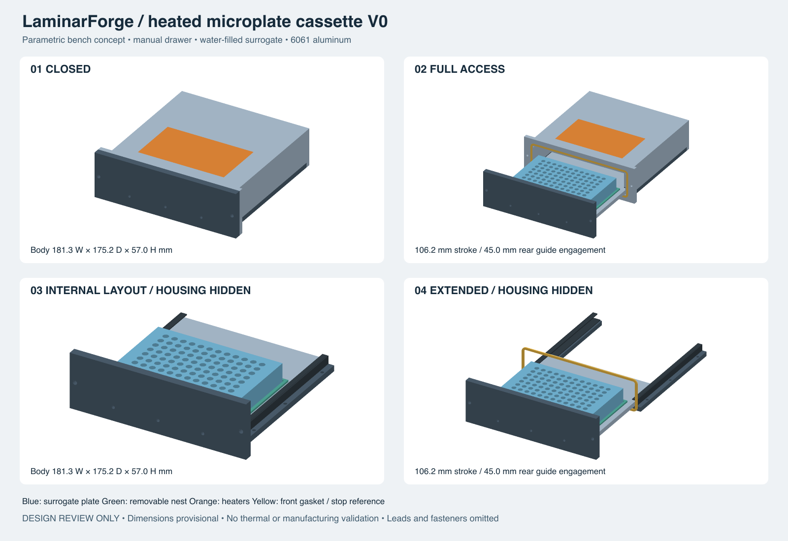

# Heated microplate cassette V0 — design review

2026-09-13. **Concept geometry, not released for machining.**

This design implements Alex's single-plate heated drawer architecture. It is
separate from the older sixteen-slot cassette. The first experiment uses water
in an inexpensive standard microplate. Neither this enclosure nor that test
establishes tissue compatibility, sterility, perfusion or culture performance.



[Self-contained SVG review sheet](design-review.svg).

## Architecture

The fixed 6061 housing contains the roof, side walls and an integral front seal
bezel. A removable rear cover closes the back. Two bolted lower rails capture
the drawer against replaceable polymer bearing strips. The strips are at the
drawer edges, outside the plate-to-aluminum heat path. A thin, replaceable
aluminum locating frame surrounds the plate base; it has no floor. The plate
rests directly on the heated aluminum drawer, although the actual plate skirt
and well geometry determine which surfaces make contact.

Drawer travel follows the short plate dimension. Its rear extension remains
captured after all wells clear the housing. One shoulder stop pin in a long
slot limits withdrawal. Two manual M4 closing screws outside the gasket path
pull the flange onto the housing face. The face is the mechanical compression
stop. Loosen/disengage both screws before pulling the drawer; this is a manual
bench arrangement. The flange side ears provide a grip. Screw knobs, final
shoulder hardware and cable loops are not represented by production solids.

The front gasket engages only during the last 0.5 mm of closing in this
candidate. Its rounded rectangular groove is machined into the integral bezel.
No fastener crosses the seal path. This is a thermal draft seal. **Clearances
around the sliding floor remain leakage paths; the model is not airtight.**

## Nominal candidate geometry

All dimensions below are millimeters and are generated from the TOML. They
are design choices, not commercial tissue-plate specifications.

| Feature | Candidate |
|---|---:|
| Closed envelope, excluding knobs/leads/fixtures | 181.26 × 175.23 × 57.0 |
| Nominal drawer stroke | 106.23 |
| Drawer length including retained tail | 157.23 |
| Plate footprint | 127.76 × 85.48 |
| Surrogate plate height, including any lid envelope | 20.0, adjustable |
| Clearance around plate base | 0.75 per side |
| Clearance above surrogate | 8.0 |
| Replaceable nest outside | 135.26 × 92.98 |
| Drawer width / aluminum thickness | 149.26 / 6.0 |
| Roof spreader thickness | 6.0 |
| Vertical guide free play | 0.30 |
| Lateral guide free play | 0.25 per side |
| Bearing strip thickness | 1.0 |
| Nominal rear engagement at full extension | 45.0 |
| Front opening | 150.26 wide; z = 6.5 to 41.0 |
| Gasket flat-frame section | 3.0 wide × 2.0 free thickness, provisional |
| Groove depth / nominal squeeze | 1.5 / 25%, provisional |
| Heater recesses | 110 × 65 × 0.6, provisional envelopes |

`verification.json` is authoritative for all derived dimensions, including
drawer length, stroke and overall envelope. Coordinates: X across the long
plate dimension, Y into the housing, Z up. The fixed front seal plane is Y=0;
the closed flange occupies negative Y. The support rails start at Z=0. The
full-extension plate rear edge clears Y=0 by 5 mm. Upper guide engagement
starts at Y=6, so the rear tail is lengthened to preserve the full 45 mm.

Clearances describe the intended finished geometry. Machine allowances for
anodizing and bearing attachment must be agreed with the shop. The current
25% gasket squeeze is only a geometric candidate: compound, compression
force, tolerance and aging data must qualify it before fabrication.

## Parts and machining approach

| Custom aluminum part | Qty | Machining direction |
|---|---:|---|
| Fixed U housing with integral front bezel | 1 | Open underside cavity and shallow guide relief; front groove/opening; rear drill/tap operations |
| Rear cover | 1 | Flat plate with four clearance holes |
| Heated drawer including retained tail | 1 | Flat stock; heater pocket underneath; guide stop slot; nest and front-flange attachments |
| Drawer front flange | 1 | Flat stock with three M3 attachment and two M4 closure holes |
| Guide rails | 2 | Flat bars, drill operations; left has stop access |
| Replaceable locating frame | 1 | Thin aluminum frame, two M2 attachments |

Seven aluminum pieces, six designs. Six guide-strip pieces and one gasket are
additional replaceable components. Compare a machined housing with a bolted
plate construction when quoting; do not assume billet removal is cheapest.
The two-depth underside pocket avoids an inaccessible T-slot. All modeled
threads are pilot holes and must be explicitly called out on manufacturing
drawings. Interior pocket corner radii, edge breaks, thread engagement, bolt
heads, gasket retention, coating masks and cutter access still need DFM detail.
The sharp rectangular heater-pocket and nest corners in this concept must
be replaced with cutter-compatible radii/reliefs before manufacturing.

The nominal modeled aluminum volume corresponds to approximately 1.59 kg
using a provisional 2.70 g/cm³ density, excluding hardware, heaters and plate.
This is a bench prototype, not a weight-optimized rack module.

For later extrusion, keep the U/guide cross-section constant and replace the
integral front bezel with a properly engineered end attachment. That volume
revision is not designed here. Do not silently change 6061 to another alloy.

## Heating and instrumentation

The two orange bodies are heater reservation envelopes, not selected heater
parts. Zone 1 heats the external roof, spreading through the roof and side
walls. Zone 2 heats the underside of the drawer below the surrogate plate.
There is no insulating bearing material below the plate footprint.

Proposed instrumentation locations, relative to the generated coordinates:

- Housing feedback RTD: on the roof adjacent to the heater, near the plate
  centerline; leave a sensor/adhesive land outside the recess. Select the actual
  sensor package before cutting its recess or drilling a sensor bore.
- Drawer feedback RTD: underside adjacent to its heater, travelling with the
  drawer; keep it clear of guide contact and support-frame fasteners.
- Water probes: center, four corners and representative edge wells; use
  calibrated immersion-compatible probes, not aluminum temperature alone.
- Independent hardware overtemperature cutoff for each zone, capable of
  interrupting heater power even if a controller/output switch fails on.

Use a fused low-voltage supply and two independently switched heater circuits.
Final heater wattage, supply rating, temperature limits and PID gains remain
unselected. Recess depth includes no qualified adhesive/lead stack yet. Route
the drawer cable in a strain-relieved service loop below the open center of
the rails, away from the stop slot and seal. Reserve that loop's full stroke
and bend radius before installing the cassette on a shelf. The current model
does not validate cable clearance, connectors, covers or electrical safety.

Heating-only control requires ambient below the requested media temperature.
No 37°C claim applies when the rack environment is itself 37°C or hotter.

## Rocking and access

The retained tail, captured guides, withdrawal stop and screw closure provide
a direction compatible with later whole-cassette rocking; no horizontal-only
gravity latch is used. A bolted shelf fixture should support the two lower
rails with separate mounting hardware. Pivot, rocker, shelf bracket and
positive vertical plate clips remain subsequent designs. Do not rock a loaded
prototype until plate retention, spill behavior and cable travel are checked.
Do not claim the assembly is rated for a particular angle or extended load.

Top access is available with the drawer fully extended. The closed plate
height is intentionally provisional. Inverted microscopy requires transferring
the plate out or a future optical insert; the solid thermal-validation drawer
blocks underside imaging. Gas-permeable plate bottoms may also require a
different support insert. A larger or lidded plate can change the entire
housing height and access envelope, not just the locating frame.

## Verification performed by the generator

- Strict required TOML fields; missing, misspelled, nonfinite and invalid
  dimensions fail before geometry generation.
- Positive geometry volume and closed triangle-edge incidence for every part.
- Moving parts, including the surrogate plate, checked against every fixed
  non-reference part at 0%, 25%, 50%, 75% and 100% travel.
- Geometry bounds, triangle counts and output hashes recorded per part.
- Configuration, source, binary and Git identity recorded with the outputs.

These checks do not certify continuous motion, fastener loads, flange bending,
seal pressure, structural stiffness, thermals or manufacturing tolerances.
The well pattern in the blue surrogate is illustrative, not a vendor CAD
model or valid water-volume model. Gasket and heater envelopes are reference
geometry. STL is review/fit geometry; it is not a machining STEP release.

Observed checks on 2026-09-13: the nominal 20 mm surrogate generated 18
component/reference meshes with all five travel positions passing. A 25 mm
surrogate regenerated successfully at 62 mm overall height with all five
positions passing. A 10 mm retained tail was rejected, and a misspelled
`plate_x_typo` field was rejected. The review PNG was rendered from the SVG
with librsvg and visually inspected. No package-wide tests were run.

## Next engineering gates

1. Select and measure the inexpensive water-test plate, including lid/skirt.
   Obtain the intended tissue plate's drawing before committing costly housing
   dimensions. Change `surrogate_plate_z` if measurement requires it.
2. Resolve heater and feedback sensor package/lead envelopes; qualify bonding
   on the actual anodize. Add final strain relief and protective covers.
3. Select a silicone profile/compound and obtain compression data. Calculate
   closing force and flange deflection; assess the hot/cold tolerance stack.
4. Detail guide shoes/attachment, shoulder stop hardware, fasteners, shelf
   mounting and rocking plate retention. Complete CNC radii and drawings.
5. Generate and verify solid STEP files and dimensioned drawings for the
   agreed revision; then request actual Thailand quotes.
6. Instrument water-filled wells and measure steady-state spread, warmup,
   opening recovery, evaporation and safe shutdown. No biology before results.

For the water test, begin by proposing 37.0°C ±0.5°C at every measured location
and ≤0.5°C spatial spread after stabilization, then establish recovery time
experimentally. These are provisional engineering targets, not tissue-specific
requirements or achieved performance. Record ambient, volume, lid state,
sensor calibration/uncertainty, both metal temperatures and all water traces.

## Reproduce locally

Use the local `laminarforge_build` MCP tool, target
`heated_microplate_cassette_v0`, `profile: dev`, `action: run`, and arguments:

```json
["--config", "models/heated_microplate_cassette_v0.toml", "--output-dir", "output/heated-cassette-v0/new-candidate"]
```

The output directory must be empty. For configuration-only iteration, use
`execute` after the intended source has been built. Add `--validate-only` to
check inputs without creating geometry. The generated `design-review.svg`
shows closed, extended and housing-hidden views from the actual mesh.

## Research basis

Baseline A-32717635; plate research A-1CB28FCF; thermal A-8B8BB8B2;
mechanical/Thailand A-5FAA9119. Current user instructions supersede older
sixteen-slot/custom-tissue-plate designs.

- [igus drylin T](https://www.igus.co.uk/linear-technology/drylin-t-rail-guides/assembly-instructions/technical-data): polymer sliding elements against hard-anodized rails support the guide material direction, not load ratings for this custom guide.
- [Parker face-seal compression](https://blog.parker.com/us/en/emg_oes/how-to-design-an-o-ring-gland-part-2-compression-us.html): final compound and profile determine compression force and allowable squeeze.
- [AAC anodizing FAQ](https://www.anodizing.org/anodized-aluminum-faq/): agree coating growth and masking with the shop; Type II and Type III are different finishes.
- [Omega foil-heater family](https://assets.omega.com/spec/KHRA-KHLVA-KHA-SERIES.pdf): reference technology, not a selected part or wattage.
